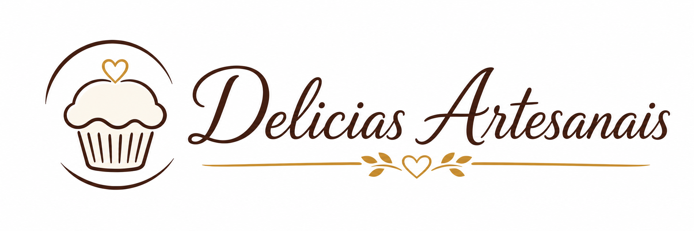

# Delicias Artesanais | Menu Online

Menu online para apresentacao de produtos artesanais sem gluten e sem lactose.
O projeto exibe bolos, pães e tortas em cards com imagem, descrição e preço.

## 📸 Demonstracao



## 🚀 Tecnologias

- HTML5
- CSS3
- JavaScript
- Git

## ✨ Funcionalidades

- Interface responsiva
- Design simples e moderno
- Navegacao intuitiva
- Filtros de produtos por categoria
- Cards com imagem, descricao e preco
- Destaque visual para a categoria ativa

## 📁 Estrutura do Projeto

```text
📂 menuSandra
 ├── 📂 images
 │   └── delicias-artesanais-logo-no-wheat.png
 ├── app.js
 ├── index.html
 ├── README.md
 └── style.css
```

## ▶️ Como executar

1. Clone o repositorio

```bash
git clone https://github.com/izaqueqv/menuSandra.git
```

2. Acesse a pasta do projeto

```bash
cd menuSandra
```

3. Abra o arquivo `index.html` no navegador.

## 🌐 Projeto Online

https://izaqueqv.github.io/menuSandra

## 👨‍💻 Autor

**Izaque Vieira**

- GitHub: https://github.com/izaqueqv
- LinkedIn: https://linkedin.com/in/izaquequerino
