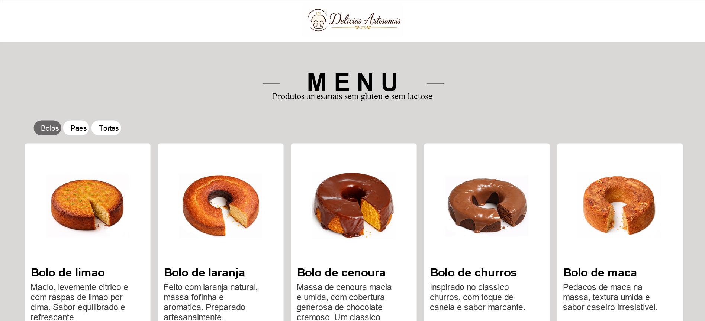

# Delícias Artesanais | Menu Online

Menu online para apresentação de produtos artesanais sem glúten e sem lactose.
O projeto exibe bolos, pães e tortas em cards com imagem, descrição e preço.

## Demonstração



## Tecnologias

- HTML5
- CSS3
- JavaScript

## Funcionalidades

- Listagem de produtos em cards
- Filtro por categoria: bolos, pães e tortas
- Categoria de bolos carregada como visualização inicial
- Destaque visual para o filtro ativo
- Layout responsivo para telas menores
- Botão de pedido em cada produto

## Estrutura do Projeto

```text
menuProject/
|-- images/
|   |-- delicias-artesanais-logo-no-wheat.png
|   |-- bread01Crop.png
|   |-- carrotCakeCrop.png
|   |-- pie.png
|   `-- ...
|-- app.js
|-- index.html
|-- README.md
`-- style.css
```

## Como visualizar

Clone o repositório e abra o arquivo `index.html` no navegador:

```bash
git clone https://github.com/Izaqueqv/menuProject.git
cd menuProject
```

Como o projeto é estático, não é necessário instalar dependências, rodar build ou iniciar um servidor local.

## Projeto Online

https://izaqueqv.github.io/menuProject

## Autor

**Izaque Querino**

- GitHub: https://github.com/Izaqueqv
- LinkedIn: https://linkedin.com/in/izaquequerino
